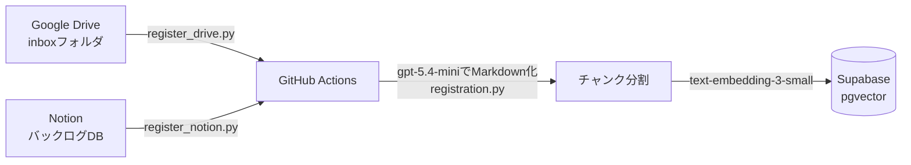
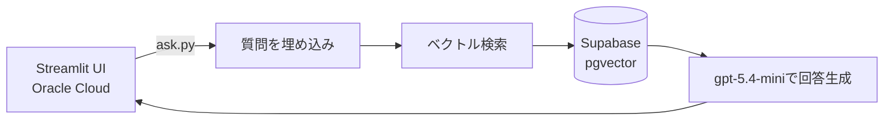

## 概要

- Azure for Students・Supabase Free・GitHub Actions・Oracle Cloud Always Freeを組み合わせて、RAGシステムを無料で作成
- 1ページのMarkdown化にかかるコストは約$0.006。応答用のモデル仕様を含めても年間$100のAzure for Studentsクレジットで十分運用可能

## 作ったもの

今回作成するのは、RAGシステムと言われる検索の仕組みです。学内の資料やPDF、授業ノートなどを横断的に検索して、質問に答えてくれます。
その作成にはAIの使用が必要になってきます。

AI関連の請求書に、学生が笑って耐えられる金額なんてあるでしょうか。そんなものはない、というわけで全部無料枠だけで組むしかありません。
そんなわけで、今回は無料枠を駆使して作ってみました。

## RAGとは何か

RAG(Retrieval-Augmented Generation)は、AIに答えさせる前に、まず資料を検索させる仕組みです。AI単体に聞くと、知らないことでも知ったかぶりで答えてしまうことがあります。先に関連する資料を検索して、それをもとに答えさせれば、少なくとも手元の資料に書いてあることについては、根拠のある答えを返せます。
また、大量の資料が存在していても、かなり高速に返答することが可能です。

## 技術スタックと構成

ここが今回の記事の肝です。使ったサービスは、全部無料枠の範囲に収まっています。

- **Azure for Students**(年間$100クレジット): 埋め込みモデル[text-embedding-3-small](https://learn.microsoft.com/en-us/azure/ai-services/openai/concepts/models)と、回答生成用のgpt-5.4-mini
- **[Supabase](https://supabase.com/) Free**(Postgres+[pgvector](https://github.com/pgvector/pgvector)、500MB): ベクトルDB
- **[GitHub Actions](https://github.com/features/actions)**: 資料の定期登録処理。runnerのメモリが7GBあるので、重い処理はここに寄せています
- **Oracle Cloud Always Free**(VM.Standard.E2.1.Micro、メモリ1GB): [Streamlit](https://streamlit.io/)のチャットUI。[Terraform](https://www.terraform.io/)で構築して、systemdで常駐させています。実測のメモリ使用量は47MB
- **Google Drive**: 学内資料(PDF・画像・Excel・PowerPoint等)の置き場所
- **[Notion](https://developers.notion.com/)**: もう一つの資料の置き場所。授業とは別に自分用のメモ・バックログをNotionに書いているので、そちらも検索対象にしている

無料で作りつつも、実際に使いやすいシステムを目指して作りました。学校の講義等で、パソコンに資料を保存するので、その保存した資料が自動的にRAGシステムに登録されるようにしています。
資料の取り込み経路は2つあります。Google Driveの指定フォルダに資料を置くと、GitHub Actionsが未登録分を検出して、gpt-5.4-miniでMarkdown化して、チャンクに分割して、Azureの埋め込みモデルでベクトル化して、Supabaseに保存します。
僕の場合は、PCのローカルフォルダとGoogle Driveのフォルダを同期しているので、ローカルにファイルを置いた時点で自動的にRAGシステムに登録されることになります。Notionの方は、ページの中身がもともとテキストなので、gpt-5.4-miniによる変換を挟まず、[Notion API](https://developers.notion.com/)から直接Markdownを取得し、同じようにチャンク化・埋め込みをします。質問が来たときは、同じように埋め込んで、ベクトル検索にかけて見つかったチャンクをもとに回答を生成します。


## どうやって作ったか

**登録の流れ**



**応答の流れ**



ここからは、実際にどう組んでいったかを4つに分けて書きます。

### Azureのセットアップ

[Azure for Students](https://azure.microsoft.com/ja-jp/free/students)は大学のメールアドレスがあれば年間$100クレジットで使えます。ただし大学テナント経由でサインインしないとテナントエラーで弾かれるので、大学のメールアドレスでサインアップする必要があります。

サインアップできたら、まずリソースグループを新たに作成します。Azure for Studentsでは作成できるリージョンが一部の地域に限られており、僕の場合はJapan West・Southeast Asia・Malaysia West・East Asia・Central Indiaの5つしかありませんでした。
このリソースグループの中に、[Azure AI Foundry](https://azure.microsoft.com/en-us/products/ai-foundry)のリソースを作っていきます。Azure AI Foundryは、Azure OpenAI ServiceとAzure AI Searchをまとめて使えるサービスです。
リージョンをJapan Westで作ろうとしたのですが、Japan Westはモデルのクォータがほぼ0だったため、最終的にSoutheast Asiaにプロジェクトを作り直しました。
Japan Westはなぜか不遇な扱いを受けているようです。どうしてもJapan Westで作成したい場合は、[クォータを要求](https://customervoice.microsoft.com/Pages/ResponsePage.aspx?id=v4j5cvGGr0GRqy180BHbR4xPXO648sJKt4GoXAed-0pUMEZWMDJZSFlVTjA1UzNNUEZWQUxWM09PTiQlQCN0PWcu)することができるみたいなのでそれを利用するのが良いかもしれません

デプロイしたモデルは2つです。

- 埋め込み: `text-embedding-3-small`(デフォルトの1536次元ではなく、APIの`dimensions`パラメータで512に縮小。Supabase Freeの容量を節約するため)
- 回答生成: `gpt-5.4-mini`

### GitHub Actionsの設定

GitHub Actionsは無料枠で2000分/月の利用が可能なので、ほとんどの場合無料枠で収めることが可能だと思います(仮に1時間に一回実行で1分かかるとしても、24 * 30 = 720で余裕)

はじめはscheduleを使って、以下のように1時間おきのcronで書いていました。

```yaml
on:
  schedule:
    - cron: "17 * * * *"
```

ところが、なかなか実行されません。調べてみると、GitHub Actions純正のscheduleは、個人アカウント・低頻度リポジトリだと正常な間隔で発火しないことが多いようです([公式ドキュメント](https://docs.github.com/en/actions/writing-workflows/choosing-when-your-workflow-runs/events-that-trigger-workflows#schedule)にも、高負荷時にはscheduleが遅延・間引かれることがあると明記されています)。実際のログを見ると、14:02→19:24→23:41のように4〜5時間おきにしか動いていませんでした。

それならばと、scheduleはやめて、後述のOracle Cloud上のVMからsystemdタイマーで`gh workflow run`を叩き、手動で`workflow_dispatch`を起動する形に変えました。Oracle Cloud上で登録処理そのものを実行しないのは、VMのメモリが1GBしかない雑魚だからです。重いPDF処理はGitHub Actions側(メモリ7GB)に任せて、VM側はトリガーを送るだけにしています。

### Oracle Cloudの設定

こちらも無料の、[Oracle Cloud Always Free](https://www.oracle.com/jp/cloud/free/)を使用することで無料での実装を実現しています。
VM上でサーバーを立ち上げて外部に公開する形にしています。

VCN・サブネット・セキュリティリスト・VMインスタンスを作っています。インスタンスは`VM.Standard.E2.1.Micro`(Always Free枠)です。(Ampereのもっといいやつが存在するのですが、関西リージョンで登録してしまったせいで確保できなかった)

VM作成後は、`gh`コマンドでデバイスコードログインしてprivateリポジトリをclone、Streamlitアプリは`systemd`サービスとして常駐させています。そして、24時間稼働しているこのVMを、GitHub Actionsのscheduleの代わりのトリガー役としても使っています


### リポジトリ構成と大まかな役割

実際のリポジトリは、こういう構成になっています。

```
ai-librarian/
├── .env                      # Azure・Supabase・Google・Notionの認証情報(gitignore)
├── .github/workflows/
│   └── register.yml          # GitHub Actionsの登録ワークフロー
├── infra/oci/                # Oracle Cloud用のTerraform
├── scripts/
│   ├── extractors.py         # PDF/画像/Excel/PowerPointを「ページのリスト」に変換
│   ├── registration.py       # Markdown化→チャンク分割→埋め込み→Supabase登録の共通処理
│   ├── register.py           # ローカルのdata/inbox配下を登録(動作確認用)
│   ├── register_drive.py     # Google Driveのinboxフォルダを登録
│   ├── register_notion.py    # Notionのバックログを登録
│   ├── db.py                 # Supabase接続
│   ├── ask.py                # 質問→検索→回答生成
│   ├── app.py                 # Streamlitのチャット画面
│   ├── apply_sql.py           # SQLファイルの適用
│   └── check_connection.py    # 接続・pgvector拡張の確認
├── sql/                        # テーブル定義
└── data/inbox/                 # ローカルテスト用の資料置き場
```

登録系のスクリプト(`register.py`・`register_drive.py`・`register_notion.py`)は、資料の取得元が違うだけで、Markdown化からSupabase登録までの共通処理は`registration.py`にまとめています。ファイル形式ごとの違い(PDFか画像かExcelか)は`extractors.py`が吸収して、どちらも同じ「ページのリスト」という形に揃えてから渡します。

そもそもなぜ`pypdf`のような従来のPDF抽出ライブラリやOCRではなく、`gpt-5.4-mini`にページ画像を渡してMarkdown化させているかというと、理由は2つあります。1つは、生のテキストをそのままチャンク分割すると、表の途中で切れたり、表のセルが読んだ順にバラバラに並ぶだけでどの行のどの列か分からなくなったりすること。もう1つは、スキャンPDFや写真のような画像だけの資料も同じ経路でRAGに取り込みたかったことです。画像は文字が選択できないので`pypdf`では抽出できませんが、`gpt-5.4-mini`に統一すれば、表のレイアウトを保ったまま、PDFでも画像でも同じ処理で扱えます。

アプリ部分(`app.py`)は、今回はあまり凝らずに最低限の3つだけ実装しました。

- **Cookieによるパスワード認証**: URLクエリパラメータにトークンを載せる方式だと、リンクが漏れただけでログインなしで見られてしまうため、Cookieに認証トークンを持たせてブラウザのリロードをまたいで認証状態を維持する方式にしています
- **チャット画面**: 質問すると資料を検索して回答し、出典(Google DriveやNotionへのリンク)も一緒に表示します
- **履歴検索**: 質問と回答はすべて`chat_log`テーブルに記録していて、サイドバーから過去のやり取りを全文検索できます

## 検索の仕組み

「技術スタックと構成」で軽く触れた検索の中身を、もう少し詳しく書きます。
もっと根本的に、ベクトル検索の仕組みを知りたい場合は、[Supabaseのドキュメント](https://supabase.com/docs/guides/ai)や他のQiita記事を参照してください

### 登録時: チャンク分割と埋め込み

`registration.py`の`chunk_text()`が本文を500トークンごとのチャンクに分割します。ただし機械的に500トークンで区切るのではなく、空行区切りの段落単位でまとめていて、表がある段落は行の途中で分割しないようにしています(表の行の途中で切ると、セルの内容が壊れて文字化けするため)。

分割したチャンクはそれぞれ`text-embedding-3-small`(512次元)でベクトル化し、Supabaseの`chunks`テーブルに保存します。

### 検索時: ベクトル検索だけでは足りない

質問が来たら、同じ`text-embedding-3-small`で質問文もベクトル化し、コサイン距離が近い順にチャンクを取得します(`ask.py`の`search()`、上位5件)。

ただ、ベクトル検索だけだと固有名詞の完全一致に弱いという弱点があります。「**の担当アドバイザーは誰か」のような質問だと、正解のチャンクが類似度順で30位以降に沈んでしまい、上位5件に入らないことがありました。そこで、質問文から漢字・カタカナ・ラテン文字の連続部分(固有名詞らしき部分)を正規表現で抜き出し、本文に完全一致するチャンクをキーワード検索で追加する、ハイブリッド検索にしています(`combined_search()`)。既存のベクトル検索結果を置き換えるのではなく、あくまで追加する設計にしてあります。

さらに、1回の検索だけでは答えられない質問(「**の担当アドバイザーとの面談はいつ?」のように、名簿でアドバイザー名を調べてから、別の日程表をその名前で検索する必要がある質問)に対応するため、検索結果を読んで新しく分かった固有名詞を`gpt-5.4-mini`に1つ抽出させ、見つかればその固有名詞でもう一段階検索する多段階検索も入れています(`find_new_entity()` → `research()`)。「情報は十分か」を判定させるのではなく、「新しい固有名詞があるか」という機械的な抽出だけに絞っているのがポイントです。曖昧な十分性の判断をLLMにさせると、同じ質問でも結果がばらついて信頼できませんでした。

最後に、集まった資料の本文をもとに`gpt-5.4-mini`が回答を生成します。

まとめると、`text-embedding-3-small`は登録時のチャンクと質問文の両方をベクトル化する役目、`gpt-5.4-mini`は「画像のMarkdown化」「新しい固有名詞の抽出」「最終的な回答生成」の3つの役目を兼任している形です。

### 高速化: HNSWインデックス

チャンクが増えてくると、質問のたびに全チャンクとの距離をしらみつぶしに計算する(線形探索)のは遅くなります。そこで、[pgvector](https://github.com/pgvector/pgvector)の[HNSW](https://github.com/pgvector/pgvector#hnsw)インデックスを使って近似最近傍探索にしています。

```sql
create index if not exists chunks_embedding_idx
    on chunks using hnsw (embedding vector_cosine_ops);
```

厳密な最近傍ではなく近似ですが、個人用途でチャンク数がこの規模である限り、精度を犠牲にしていると感じたことはないです。

## 実際の動作

ここまで仕組みの説明ばかりだったので、実際に動いているところも見せます。ただし実際の個人情報を使うわけにはいかないので、架空のサンプルPDFを2つ作って登録しました(by Gemini)

- **アドバイザー名簿**: 学生ごとの担当アドバイザーが書かれた表。ただし面談可能な日時は載っていない


- **面談日程表**: アドバイザーごとの面談可能日時・連絡先が書かれた、別の表。ただしどの学生を担当しているかは載っていない


この2つは別々の資料なので、「ある学生の面談日程」を知るには、名簿でアドバイザー名を調べてから、面談日程表をそのアドバイザー名で調べ直す必要があります。まさに「検索の仕組み」で書いた多段階検索が必要になる場面です。

実際に聞いてみた結果がこちらです。


「山田太郎さんのアドバイザーとの面談はいつ可能ですか?」と聞くと、まず名簿から山田太郎さんのアドバイザーが鈴木一郎(教授)だと特定し、「名簿の対応表だけでは面談日時は分かりません」と一度正直に留保した上で、別資料の面談日程表から鈴木一郎の面談可能日時(10月1日・2日・6日の時間帯、5日は不可)と予約用のメールアドレスまで拾って回答できています。

1回の検索だけだと名簿の情報しか出てこないところを、`find_new_entity()`が「鈴木一郎」という新しい固有名詞を検出してもう一段階検索をかけたことで、別文書の情報までたどり着けています。狙い通り多段階検索が機能していることを、この一問で確認できました。
正直この例ではRAGの恩恵を感じることはできませんが、資料数が増えて、探す範囲が大きくなるほどその高速さ、正確さを実感できるはずです。

## かかったコスト

単価はSoutheast Asia・Global Standardの2026-09-30時点のものです。

| モデル                   | 単価                |
| ------------------------ | ------------------- |
| `gpt-5.4-mini` 入力      | $0.75 / 1Mトークン  |
| `gpt-5.4-mini` 出力      | $4.50 / 1Mトークン  |
| `text-embedding-3-small` | $0.024 / 1Mトークン |

登録時にかかるのは、1ページのMarkdown化(前述の約$0.006/ページ、`gpt-5.4-mini`)と、チャンクごとの埋め込み(`text-embedding-3-small`)です。埋め込みは1Mトークンあたり$0.024と非常に安いので、チャンク数が増えても金額としてはほぼ誤差です。

質問時は、1回につき、質問文をベクトル化する埋め込み1回、`find_new_entity()`による`gpt-5.4-mini`呼び出し1回(常に発生)、多段階検索に進んだ場合は追加の埋め込みと検索、最後に`answer()`による`gpt-5.4-mini`呼び出し1回、がかかります。

実際の使用量よりやや多めに、「月100ページ登録・1日5問質問(年1800問)」という想定で年間コストを試算すると、こうなります。

| 項目                    | 年間コスト        |
| ----------------------- | ----------------- |
| ページ→Markdown変換     | 約$7.2            |
| 埋め込み                | 約$0.02(誤差程度) |
| 質問応答(検索+回答生成) | 約$7.6            |
| **合計**                | **約$15**         |

登録ページ数を当初の想定から5倍(月100ページ)にしても、埋め込み自体の単価が非常に安いため合計コストへの影響はごくわずかです。年間$15程度に収まり、$100クレジットに対してかなり余裕があります。コストを左右しているのは埋め込みではなく、`gpt-5.4-mini`によるページ変換と質問応答の方です。

## 学んだこと

無料枠だけでRAGシステムを組むと言うと、技術的に難しい部分で苦労する話だと思われるかもしれません。実際に一番時間を溶かしたのは、検索のロジックでも埋め込みモデルの精度でもなく、リージョン・クォータ・デプロイ方式・スケジューラの間引きといった、地味な制約の方でした。
でも、お金が実装の制約になるのは勿体無いと思ったので、今回は無料で実際に使えるレベルのおもしろ開発をやってみました。

今回は「まず動くところまで完成させる」ことを優先したので、精度を詰め切れていない部分もまだ残っています。例えば、チャンク分割にオーバーラップ(隣接するチャンクの境界を少し重複させて、文脈が分断されるのを防ぐ手法)を入れていません。今のところ実用上困ってはいませんが、資料が増えて境界をまたぐ質問が増えてきたときに、最初に手を入れる部分になる気がします

ここまで読んでいただきありがとうございました!