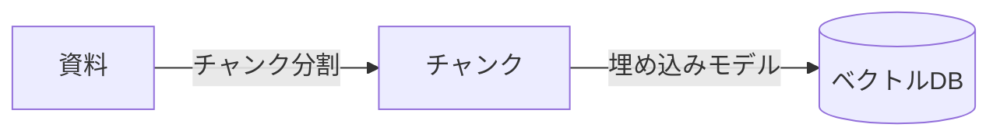

最近何かと話題のRAGという技術について調べ直した記事です!

## 概要

- RAG(Retrieval-Augmented Generation)は、LLMに答えさせる前に関連資料を検索させる仕組み
- この記事では、RAGを支える技術を「チャンク分割」「埋め込み」「ベクトル検索」「ハイブリッド検索」「マルチホップ/Agentic RAG」「評価」の6つに分けて、それぞれ何をしていて何が課題なのかを整理
- 「コンテキストが長いLLMがあればRAGは要らないのでは?」という疑問

## RAGの必要性

LLM単体には2つの弱点があります。1つは知識のカット、学習した時点より後の情報は知りません。もう1つはハルシネーション、知らないことでも、もっともらしい文章で答えてしまうことがあります。

RAGは、この2つに対して「答える前に資料を検索させる」という形で対応します。これだけで、少なくとも手元の資料に書いてある範囲については根拠のある答えを返せるようになります。資料を差し替えるだけで最新情報に対応できるのも利点で、LLM自体を学習し直す必要がありません。

この発想の原典は、2020年にMeta AI(当時Facebook AI Research)のPatrick Lewisらが発表した論文[^rag-paper]。「検索(Retrieval)」と「生成(Generation)」を組み合わせる、という今では当たり前になった構図は、ここが起点になっているようです。

[^rag-paper]: Lewis et al., "Retrieval-Augmented Generation for Knowledge-Intensive NLP Tasks" (NeurIPS 2020) https://arxiv.org/abs/2005.11401

## RAGの全体像: 登録と応答、2つのフェーズ

RAGのシステムは、大きく2つのフェーズに分かれます。資料を検索できる状態にしておく「登録フェーズ」と、質問が来たときに検索して答える「応答フェーズ」です。




## そもそも「ベクトル化」とは何か

ここから技術の話に入っていきますが、その前に「ベクトル化」そのものに触れておきます。上の図に出てきた「ベクトルDB」が何なのか分からないと、何が何やらわからないと思うので、まずはベクトル化のイメージを掴んでおきます。

コンピュータは、2つの文章が「意味的に近い」かどうかを、文字列としては直接比較できません。そこで、文章を一定個数の数字の列(ベクトル)に変換します。これが「埋め込み(embedding)」と呼ばれる処理です。3次元のベクトルであれば、文章が空間上の1つの点に対応するイメージです。実際にはもっと高次元な空間を使いますが、考え方は同じです。

ポイントは、意味が近い文章ほど、空間上でも近い位置に来るように埋め込みモデルが学習されていることです。「猫」と「子猫」のベクトルは近く、「猫」と「経済成長率」のベクトルは遠い、というイメージです。この「近さ」を距離として計算できるようになったことで、文字列としては一致していなくても意味的に近い文章を検索で見つけられます。これが、後述する「ベクトル検索」の土台になります。

## 技術1: チャンク分割

資料をまるごと埋め込みモデルに読ませるのはコストが高いし、長すぎる資料は検索にも向きません。そこで、資料を「チャンク」と呼ばれる小さな単位に分割してから検索対象にします。

### 分割方法の種類

分割の仕方にはいくつかやり方があります。

- **固定長分割**: 機械的にN文字(またはNトークン)ごとに区切る。実装は簡単だが、文や表の途中で切れてしまいやすい
- **意味的(セマンティック)分割**: 隣接する文同士の埋め込みを比較し、話題が変わったところで区切る
- **構造ベース分割**: 見出しや段落など、文書そのものの構造に沿って区切る

### チャンクサイズとオーバーラップ

チャンクサイズにも、地味に悩みどころがあります。大きすぎると1チャンクに複数の話題が混ざって検索の的が絞れなくなり、小さすぎると周辺の文脈が失われます。チャンクの境界をまたいで答えが分かれてしまうのを防ぐため、隣接するチャンク同士を少し重複させる「オーバーラップ」もよく使われていて、512トークンのチャンクに対して50〜100トークン程度が一つの目安です[^chunking]。

[^chunking]: Weaviate, "Chunking Strategies to Improve LLM RAG Pipeline Performance" https://weaviate.io/blog/chunking-strategies-for-rag

## 技術2: 埋め込みモデルの次元数

チャンクに分割した後は、それぞれを実際に埋め込みモデルでベクトル化していきます。ここで気になってくるのが、ベクトルの次元数です。

埋め込みベクトルの次元数は、精度とストレージ容量のトレードオフになります。たとえばOpenAIのtext-embedding-3シリーズは、Matryoshka表現学習という学習方法を使っています。重要な情報ほどベクトルの先頭の次元に集まるように学習されていて、どの次元数で切り出してもそれなりに意味のある表現になるという発想です。そのおかげで、APIの`dimensions`パラメータでベクトルの次元数を途中から削っても、概念を表す性質が大きく損なわれません[^embedding]。どこまで削ってよいかは、精度とストレージ容量のバランスを見ながら、データと用途ごとに判断することになります。

[^embedding]: OpenAI, "Vector embeddings" https://developers.openai.com/api/docs/guides/embeddings

## 技術3: ベクトル検索とANN

質問が来たら、同じ埋め込みモデルで質問文もベクトル化し、保存してあるチャンクのベクトルとの類似度を計算して、近い順に取得します。

### 線形探索の限界と近似最近傍探索

チャンク数が少ないうちは、全チャンクとの距離をしらみつぶしに計算する「線形探索」でも十分な速度で動作しますが、チャンクが増えてくると段々遅くなっていきます。そこで使われるのが近似最近傍探索(ANN)で、「厳密に一番近いもの」ではなく「結構近いもの」を高速に見つけます。

### HNSW: 階層を降りながら探す仕組み

HNSW(Hierarchical Navigable Small Worlds)は、ベクトル同士をグラフでつなぎ、それを階層構造にすることで近似最近傍を高速に探すインデックスです。


一番上の階層には、全体をざっくりつなぐ少数のベクトルしか登録されておらず、まずここで「だいたいこのあたり」という見当をつけます。そこから1つ下の階層に降りると、同じエリアにもう少し細かいベクトルが登録されていて、さらに近いものへと移動していきます。これを一番下の階層(全ベクトルが登録されている層)までたどることで、全件を総当たりで比較しなくても「近いはずの場所」にたどり着けます。

同じベクトル(図では`A`)が複数の階層にまたがって登録されている点がポイントです。上の階層ほど登録されるベクトルの数が少なくなるようにあらかじめランダムに選ばれていて、まず少数精鋭の上の階層で大まかな当たりをつけ、階層を降りるごとに候補を密にしていく、という探索戦略になっています。

### pgvectorのHNSWインデックス

PostgreSQLの拡張であるpgvectorは、HNSWのANNインデックスを提供しています[^pgvector]。

```sql
create index on chunks using hnsw (embedding vector_cosine_ops)
    with (m = 16, ef_construction = 64);
```

このように記述するだけで、HNSWインデックスが作成されます。`m`は上の図でいう、各ノードが各階層で持つ接続数、`ef_construction`は、インデックス構築時にその接続先を探す際の候補数です。どちらも値が大きいほどグラフが密になって精度は上がりますが、構築コストとインデックスサイズも増えます。

[^pgvector]: pgvector/pgvector (GitHub) https://github.com/pgvector/pgvector

## 技術4: ハイブリッド検索とリランキング

### ベクトル検索の弱点

ベクトル検索は意味的な近さに強い一方で、弱点もあります。固有名詞や専門用語のような「完全一致してほしい」語に弱いのです。たとえば人名や製品名がそのまま質問に含まれているのに、意味の近さだけで探すと、肝心のチャンクが検索結果の下の方に沈んでしまうことがあります。

### BM25との組み合わせとリランキング

この弱点を補うのが、文字列としての一致度で探すキーワード検索(BM25など)と、意味的な近さで探すベクトル検索を組み合わせる「ハイブリッド検索」です。両方を並行して実行し、それぞれの検索結果の順位を1つにまとめ直します。代表的な統合手法がRRF(Reciprocal Rank Fusion)で、各手法での順位の逆数を足し合わせることで、複数のランキングを1つのランキングに統合します。ある比較実験では、ベクトル検索単体のヒット率が0.695だったのに対し、RRFでハイブリッド化すると0.708まで上がったという報告があります[^hybrid]。ただし同じ実験では、この資料はもともと商品名と検索語の字面が一致しやすく、ベクトル検索だけでもかなり健闘していたため、ハイブリッド化による伸びしろ自体は小さかった、とも書かれています。資料の性質によって効き方が変わる、という所はありそうです。

さらに、検索で絞り込んだ候補をもう一段階並び替える「リランカー」を挟むことも多いです。最初の検索で広めに候補を集め、リランカーで本当に関連性が高いものだけに絞り込んでからLLMに渡す、という隙を生じぬ2段構えの設計です。

[^hybrid]: PremAI, "Hybrid Search for RAG: BM25, SPLADE, and Vector Search Combined" https://www.premai.io/blog/hybrid-search-for-rag-bm25-splade-and-vector-search-combined/

## 技術5: マルチホップ/Agentic RAG

「Aの担当者は誰か」を調べてから、「その担当者の連絡先はどこにあるか」を別の資料で調べ直す。こういう、検索結果をヒントに次の検索をする必要がある質問には、一回のベクトル検索では答えられません。

### Agentic RAGと質問分解

これに対応するのが、LLMエージェントが検索戦略そのものを組み立てる「Agentic RAG」という設計です。検索結果を見て、もう一度検索するかどうか、何を検索し直すかをLLM自身に判断させます。

質問を分解すれば賢くなる、くらいに単純に思っていたのですが、どうやらそう甘くはないようです。ある研究では、DevOpsデータセットでは質問分解によって検索精度のMRR(正解が検索結果の何番目に出てきたかを示す指標)が0.556から0.722に改善した一方、MuSiQueというマルチホップ質問のベンチマークでは0.469から0.102まで悪化した、という正反対の結果が報告されています[^agentic]。これはある意味当然の結果で、LLMによる不正確さを消すためにRAGを使っているのに、LLMが質問分解の段階で間違った分解をしてしまうと検索結果が悪化するためです。

## 技術6: RAGの評価方法

RAGシステムは、作って動かしただけだと「ちゃんと機能しているか」が分かりにくいものです。質問に答えてくれているように見えても、実は検索が外れていて、たまたまLLMが知っていた知識で答えているだけ、ということもままあります。

これを客観的に測るためのオープンソースフレームワークにRagasがあります。

### Ragasの4つの指標

代表的な4つの指標は次の通りです[^ragas]。

| 指標                                | 何を測るか                                                     |
| ----------------------------------- | -------------------------------------------------------------- |
| Faithfulness(忠実性)                | 回答の主張が、取得したコンテキストでどれだけ裏付けられているか |
| Response Relevancy(応答関連性)      | 回答が元の質問にどれだけ関連しているか                         |
| Context Precision(コンテキスト精度) | 取得したコンテキストのうち、実際に有用な情報の割合             |
| Context Recall(コンテキスト再現率)  | 必要な情報のうち、検索結果に含まれていた割合                   |

### 検索と生成は別々に測る

ポイントは、「検索ができているか」と「回答が正しいか」を分けて測っていることです。検索が合っていても情報が古ければ回答の質は上がりませんし、検索が多少外れていてもLLMの一般知識で帳尻が合ってしまうこともあります。

[^ragas]: Ragas公式ドキュメント, "Available Metrics" https://docs.ragas.io/en/stable/concepts/metrics/available_metrics/

## コンテキストが長いLLMがあればRAGは要らないのでは?

コンテキストウィンドウが数十万トークン規模のLLMが珍しくなくなった今、資料を全部読ませればRAGは要らないんじゃないのと思ったことはないでしょうか。実際、資料全体をまとめてLLMに渡してしまえば、検索の失敗という問題自体がなくなるようにも思えます。

ある比較研究では、long-context LLMはQAベンチマーク全般で平均するとRAGを上回る一方、対話形式の質問や一般的な質問ではRAGの方に分があり、検索するコンテキストの関連性の高さが見落とされがちな論点だと指摘されています[^longcontext]。加えて、RAGが今も選ばれる理由として次の2つは大きいと思います。

- **コスト**: 数十万トークンへのアテンションは計算コストが高い。RAGは関連部分だけに絞ることで、同じような回答をずっと少ないトークンで得られる
- **対応力**: 外部の資料を差し替えるだけで最新情報に対応でき、モデルを再学習する必要がない

特に何度も更新される資料、大量にある資料を扱う、様々な人が何度も質問するようなシステムでは、RAGの方がコスト面でも対応力の面でも有利だと思います。

[^longcontext]: "Long Context vs. RAG for LLMs: An Evaluation and Revisits" https://arxiv.org/abs/2501.01880

## まとめ

RAGを支える技術を、6つ整理しました。

ここまで言葉で追ってきた技術を、実際に無料枠だけで組み合わせて動かしてみた話は別記事にまとめています。[学生が無料枠だけでRAGシステムを作った話](https://zenn.dev/bigshine777/articles/ai-librarian-free-tier)。興味があれば、あわせて読んでみてください!
